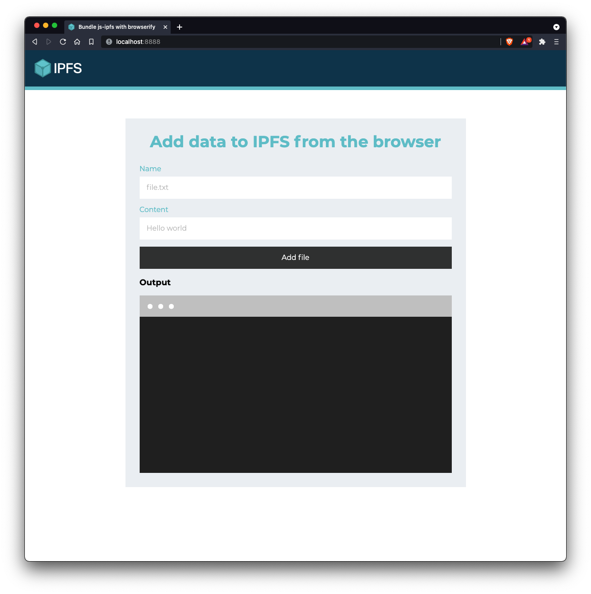
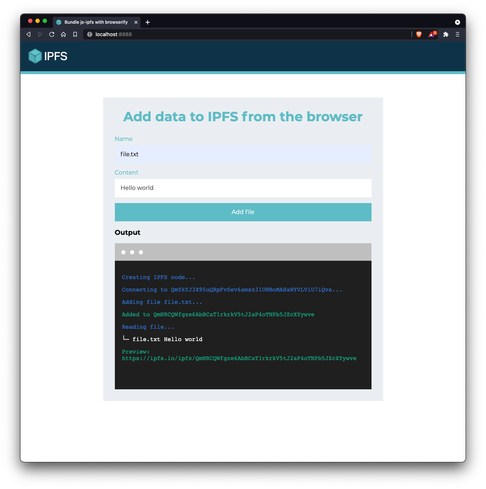

# Bundle js-ipfs with Browserify!

In this example, you will find a boilerplate you can use to guide yourself into bundling js-ipfs with [browserify](http://browserify.org/), so that you can use it in your own web app!

## Before you start

```console
$ git clone https://github.com/ipfs/js-ipfs.git
$ cd js-ipfs
$ npm install
$ npm run build
```

## Run the example

```bash
> cd examples/browser-browserify
> npm install
> npm start
```

Now open your browser at `http://localhost:8888`

You should see the following:



